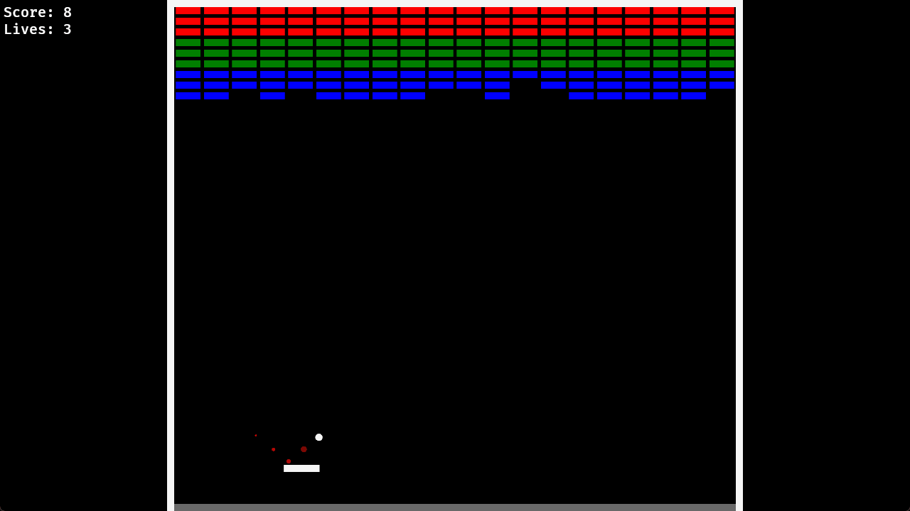

# bBreakout

[](https://aleksuo.github.io/bBreakout/)
[](https://github.com/Aleksuo/bBreakout/actions)
[](https://opensource.org/licenses/MIT)


> A simple Breakout clone built in Rust using Bevy. [Playable in the browser](https://aleksuo.github.io/bBreakout/).



## Controls
- Move left: A
- Move right: D

## Features
- Gameplay mechanics:
  - Score based on destroyed tiles
  - Three lives that get depleted when the ball hits the bottom wall
  - Simple ball physics
  - Simple particle system that is used to spawn a trail for the ball
  - A ball speedup system that is also indicated by the color of the ball trail
  - Simple audio system for sound effects
- Multiple game states:
  - Main menu screen
  - Settings screen with global volume control
  - Game state
  - Game over screen
- Playable in the browser utilizing wasm

## Prerequisites

If you only want to run the game natively:
1. Install the latest Rust version (via [rustup](https://rustup.rs/))

Optionally, if you also want to run the webapp:

2. Install Node.js 22 (via [nodejs.org](https://nodejs.org/))
3. Install project dependencies (run in root):
   ```bash
   npm ci
   ```
## Running the Project

This project uses npm scripts to orchestrate the webapp builds. You can either run the project using the root npm scripts or cargo if you want to just run the game natively.

### Cargo

Go to the `bevy-breakout` folder and run the game using cargo:

```bash
cd bevy-breakout && cargo run
``` 
Use the `--release` -argument to run the release build.

#### NPM
These scripts are available in the project root:

#### `dev:webapp`
Start the webapp in development mode:
  ```bash
  npm run dev:webapp
  ```
  > Note: This also builds and generates the wasm bindings and copies all the assets to the webapp directory. The first time you run this will take some time. Also there is no auto watch for the game wasm, this is meant just for developing the website template.

#### `dev:game`
Run the bevy game with debug build:

  ```bash
  npm run dev:game
  ```

#### `bundle-wasm`
Run the wasm target build, generate bindings and copy the artifacts to webapp:
```bash
npm run bundle-wasm
```
#### `copy-assets`
Copy the assets from the game to be used by the webapp:
```bash
npm run copy-assets
```
#### `dist:gh-pages`
Builds the bundle that is used for GitHub Pages deployment:
```bash
npm run dist:gh-pages
```

## Made with
[](https://www.rust-lang.org/)
[](https://bevy.org/)
[](https://www.typescriptlang.org/)
[](https://angular.dev/)
[](https://www.npmjs.com/)


## License

This project is dual-licensed under the terms of MIT License (MIT) or the Apache License 2.0 (Apache-2.0). See the [LICENSE-MIT](./LICENSE-MIT) and [LICENSE-APACHE](./LICENSE-APACHE) files for details.
